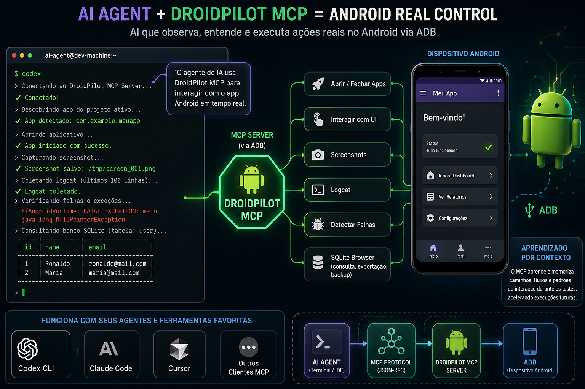

# DroidPilot MCP



DroidPilot MCP é um servidor MCP local para operar dispositivos Android usando apenas ADB. Ele expõe tools para screenshots, gestos de toque, entrada de texto, abrir/parar apps, inspecionar packages, capturar logcat e detectar sinais comuns de instabilidade Android.

O servidor roda por MCP `stdio` por padrão e não exige app Android complementar nem serviço de espelhamento ao vivo.

## Release 2026-04-28

Esta versão foca em reduzir consumo de tokens e aumentar robustez em testes Android reais:

- `android_ui_context` agora aceita `verbosity`, filtros por texto/resource-id/package e retorna `matches` para asserts objetivos sem depender de screenshot.
- O MCP passa a recomendar fallback visual para WebView, Compose com árvore fraca ou telas ambíguas.
- `android_set_sqlite_config` permite definir root, policy e banco SQLite padrão em runtime, incluindo bancos externos em `/sdcard/...` em modo leitura.
- `android_set_adb_config` valida o serial informado e o runtime auto-seleciona o único device online quando outros estão offline.
- `android_app_info`, `android_detect_known_issues`, `android_get_logcat` e `android_navigation_guide` retornam respostas compactas por padrão, mantendo dumps completos em artifacts.
- A memória de navegação passa a usar fingerprint, activity efetiva e modo de navegação preferido para orientar agentes com menos contexto.

## Requisitos

- Python 3.10+
- Android platform-tools / `adb`
- Um dispositivo Android ou emulador visível em `adb devices`
- Codex CLI, se for registrar o MCP automaticamente no Codex

## Instalação Rápida no Codex

Em Linux, macOS ou Git Bash no Windows:

```bash
curl -fsSL https://raw.githubusercontent.com/ronaldomafra/DroidPilot-MCP/main/scripts/install.sh | bash
```

No Windows PowerShell:

```powershell
irm https://raw.githubusercontent.com/ronaldomafra/DroidPilot-MCP/main/scripts/install.ps1 | iex
```

Esse comando:

- baixa ou atualiza o DroidPilot MCP em `~/.droidpilot-mcp`
- cria `.venv`
- instala `requirements.txt`
- registra o MCP no Codex apontando para `droidpilot_mcp_server.py`

Para recriar um registro MCP já existente:

```bash
curl -fsSL https://raw.githubusercontent.com/ronaldomafra/DroidPilot-MCP/main/scripts/install.sh | bash -s -- --force
```

Windows PowerShell:

```powershell
& ([scriptblock]::Create((irm https://raw.githubusercontent.com/ronaldomafra/DroidPilot-MCP/main/scripts/install.ps1))) -Force
```

Para instalar em outro diretório:

```bash
curl -fsSL https://raw.githubusercontent.com/ronaldomafra/DroidPilot-MCP/main/scripts/install.sh | bash -s -- --dir "$HOME/tools/droidpilot-mcp"
```

Windows PowerShell:

```powershell
& ([scriptblock]::Create((irm https://raw.githubusercontent.com/ronaldomafra/DroidPilot-MCP/main/scripts/install.ps1))) -Dir "$env:USERPROFILE\tools\droidpilot-mcp"
```

Opções úteis:

- `--name NAME`: nome do servidor MCP no Codex. Padrão: `DroidPilot-MCP`
- `--python CMD`: Python usado para criar o venv. Padrão: `python3`
- `--codex CMD`: binário do Codex CLI. Padrão: `codex`
- `--force`: recria o registro MCP existente
- `--dir PATH`: diretório onde o DroidPilot MCP será instalado

No PowerShell, use as mesmas opções em formato PowerShell: `-Name`, `-Python`, `-Codex`, `-Force` e `-Dir`.

Depois da instalação, configure o ADB no projeto que vai usar o MCP. O caminho mais simples é chamar a tool `android_set_adb_config`; ela cria `android-agent.config.json` no projeto ativo.

## Instalação Manual

A partir da raiz do repositório DroidPilot MCP:

```bash
python3 -m venv .venv
./.venv/bin/python -m pip install --upgrade pip
./.venv/bin/python -m pip install -r requirements.txt
./.venv/bin/python droidpilot_mcp_server.py --help
```

Windows PowerShell:

```powershell
py -3 -m venv .venv
.\.venv\Scripts\python.exe -m pip install --upgrade pip
.\.venv\Scripts\python.exe -m pip install -r requirements.txt
.\.venv\Scripts\python.exe droidpilot_mcp_server.py --help
```

## Configuração Local

O servidor lê a configuração local a partir do projeto que inicia o processo MCP, não do diretório onde o DroidPilot MCP está instalado. Por padrão ele usa:

```text
<projeto-ativo>/android-agent.config.json
```

O arquivo versionado `android-agent.config.example.json` fica no repositório DroidPilot MCP apenas como template. Copie esse arquivo para cada projeto que carrega o MCP, ou deixe a tool `android_set_adb_config` criar `android-agent.config.json` no projeto ativo.

O servidor tenta autodetectar `adb` no startup usando `PATH` e locais comuns do Android SDK. Se não encontrar `adb`, ele registra um warning, e as tools `android_adb_autodetect` e `android_set_adb_config` podem ser usadas para inspecionar ou definir o caminho.

Config local opcional:

```bash
cp /abs/path/DroidPilot-MCP/android-agent.config.example.json ./android-agent.config.json
```

Exemplo:

```json
{
  "timeoutSeconds": 12,
  "adbPath": "/opt/android/platform-tools/adb",
  "adbDeviceSerial": "",
  "packageName": "com.example.app",
  "sqliteRootPath": "databases",
  "sqliteRootAccessPolicy": "run-as-then-root",
  "sqliteDefaultDatabaseName": "",
  "autoUpdateEnabled": false,
  "updateRepoUrl": "https://github.com/ronaldomafra/DroidPilot-MCP.git",
  "updateChannel": "main",
  "artifactsDir": "tests/mcp",
  "navigationMemoryPath": "tests/mcp/navigation/navigation-guide.json"
}
```

Precedência de configuração:

1. argumentos CLI como `--adb-path` e `--adb-device-serial`
2. `android-agent.config.json`
3. variáveis de ambiente como `ANDROID_AGENT_ADB_PATH` e `ANDROID_AGENT_ADB_DEVICE_SERIAL`
4. autodetecção

`artifactsDir` e `navigationMemoryPath` também são relativos ao projeto ativo por padrão. `packageName` deve apontar para o app Android do projeto ativo quando a inferência automática não for suficiente. `sqliteRootAccessPolicy` aceita `auto`, `run-as-only`, `root-only`, `run-as-then-root` ou `external`. Para bancos externos, use `sqliteRootPath` em `/sdcard/...` ou `/storage/emulated/0/...`; o acesso inicial é somente leitura. `sqliteDefaultDatabaseName` permite consultar sem repetir `database_name`. Se `autoUpdateEnabled` estiver `true`, o MCP tenta atualizar a instalação no startup e marca `restartRequired` no status quando houver mudança aplicada.

Se o projeto ativo for versionado, adicione `android-agent.config.json` e `tests/mcp/` ao `.gitignore` dele.

## Registro Manual no Codex CLI

Se você já clonou o repositório, pode usar o instalador local:

```bash
./scripts/install_codex_mcp.sh
```

Para recriar um registro existente:

```bash
./scripts/install_codex_mcp.sh --force
```

Registro manual:

```bash
codex mcp add DroidPilot-MCP -- /abs/path/DroidPilot-MCP/.venv/bin/python /abs/path/DroidPilot-MCP/droidpilot_mcp_server.py
```

Verificação:

```bash
codex mcp list
codex mcp get DroidPilot-MCP
```

## Instalação no Cursor

Crie `.cursor/mcp.json` em um projeto, ou `~/.cursor/mcp.json` para uso global:

```json
{
  "mcpServers": {
    "DroidPilot-MCP": {
      "type": "stdio",
      "command": "/abs/path/DroidPilot-MCP/.venv/bin/python",
      "args": [
        "/abs/path/DroidPilot-MCP/droidpilot_mcp_server.py"
      ]
    }
  }
}
```

Depois reinicie o Cursor e liste as tools:

```bash
cursor-agent mcp list-tools DroidPilot-MCP
```

## Instalação no Claude Code

```bash
claude mcp add --transport stdio \
  DroidPilot-MCP \
  -- /abs/path/DroidPilot-MCP/.venv/bin/python /abs/path/DroidPilot-MCP/droidpilot_mcp_server.py
```

Se algum cliente MCP não iniciar servidores usando o projeto alvo como diretório de trabalho, passe um caminho de config explícito nos argumentos do MCP:

```json
{
  "args": [
    "/abs/path/DroidPilot-MCP/droidpilot_mcp_server.py",
    "--config",
    "/abs/path/seu-projeto/android-agent.config.json"
  ]
}
```

Verificação:

```bash
claude mcp list
claude mcp get DroidPilot-MCP
```

## Tools de Configuração ADB

- `android_adb_config`: retorna a configuração ADB efetiva e os paths da sessão.
- `android_adb_autodetect`: procura `adb` no `PATH` e em locais comuns do Android SDK.
- `android_set_adb_config`: atualiza `adbPath` e `adbDeviceSerial` em runtime, valida o serial e persiste por padrão.
- `android_set_sqlite_config`: atualiza root/política/default de SQLite em runtime e persiste por padrão.

`android_adb_config` e `android_agent_status` também expõem:

- resolução do `packageName` do projeto ativo
- diagnóstico de acesso SQLite
- status do auto-update (`installMode`, `currentRevision`, `targetRevision`, `updateApplied`, `restartRequired`)

Exemplo de entrada para a tool:

```json
{
  "adb_path": "/home/user/Android/Sdk/platform-tools/adb",
  "adb_device_serial": "emulator-5554",
  "persist": true
}
```

## Tools

- `android_agent_status`
- `android_adb_config`
- `android_adb_autodetect`
- `android_set_adb_config`
- `android_set_sqlite_config`
- `android_ui_context`
- `android_sqlite_status`
- `android_sqlite_list_databases`
- `android_sqlite_pull_database`
- `android_sqlite_query`
- `android_navigation_guide`
- `android_navigation_context`
- `android_save_navigation_note`
- `android_save_navigation_learning`
- `android_get_screen`
- `android_list_apps`
- `android_app_info`
- `android_open_app`
- `android_adb_open_app`
- `android_close_app`
- `android_tap`
- `android_swipe`
- `android_long_click`
- `android_input_text`
- `android_back`
- `android_home`
- `android_scroll`
- `android_adb_status`
- `android_clear_logcat`
- `android_get_logcat`
- `android_detect_known_issues`

## Tools SQLite

- `android_sqlite_status`: resolve o `packageName` do projeto ativo e testa acesso via `run-as`, root ou path externo configurado.
- `android_set_sqlite_config`: define `sqliteRootPath`, `sqliteRootAccessPolicy` e `sqliteDefaultDatabaseName`.
- `android_sqlite_list_databases`: lista bancos, arquivos companheiros como `-wal`/`-shm` e compacta listas grandes de backups.
- `android_sqlite_pull_database`: copia o banco default ou informado para `tests/mcp/<timestamp>/artifacts/sqlite`.
- `android_sqlite_query`: executa SQL bruto localmente em uma cópia do banco; se `database_name` vier vazio, usa `sqliteDefaultDatabaseName`.

Observações:

- Em devices sem `sqlite3` no shell Android, o MCP consulta o banco localmente com `sqlite3` do Python.
- Para apps debugáveis, o caminho preferencial é `run-as`.
- Se `run-as` falhar e a policy permitir, o MCP tenta fallback por root.
- Para bancos externos, configure `sqliteRootAccessPolicy=external` e `sqliteRootPath=/sdcard/...`; nessa versão o acesso externo é somente leitura.
- Se a IA receber o caminho completo do arquivo `.db`, pode enviar esse caminho em `sqlite_root_path`; o MCP separa diretório e `sqliteDefaultDatabaseName` automaticamente.
- Escrita em SQLite exige cuidado com app aberto e concorrência de arquivo. O MCP cria backup remoto com sufixo `.bak-<timestamp>` antes de sobrescrever.

## Tools de UI Context

- `android_ui_context`: captura a hierarquia atual via `uiautomator dump`, aceita `verbosity`, `max_items` e filtros por texto/resource-id/package, classifica a tela como `views`, `compose`, `webview`, `hybrid` ou `unknown` e informa se o agente deve navegar por estrutura ou por screenshot.
- A resposta inclui `navigationMode`, `fallbackRecommended`, `agentHint`, `screenFingerprint`, `visibleTexts`, `clickableElements` e `xmlArtifactPath`.
- Regra prática:
  - `structured`: prefira `clickableElements` e `bounds`
  - `visual`: use `android_get_screen`
  - `hybrid`: combine UI tree com fallback visual

## Fluxo Recomendado

1. Execute `android_adb_config`.
2. Se necessário, execute `android_adb_autodetect` ou `android_set_adb_config`.
3. Execute `android_adb_status` e confirme que o dispositivo alvo está visível.
4. Consulte `android_sqlite_status` para validar `packageName`, `run-as` e fallback root quando precisar mexer no banco.
5. Execute `android_clear_logcat` antes de um teste.
6. Abra o app com `android_open_app` ou `android_adb_open_app`.
7. Execute `android_ui_context` para decidir se a tela atual deve ser tratada por UI tree ou por screenshot.
8. Use `android_tap`, `android_swipe`, `android_input_text`, `android_back`, `android_home` e `android_scroll`.
9. Use `android_get_screen` principalmente para validação visual e fallback de telas como WebView.
10. Use `android_sqlite_list_databases`, `android_sqlite_pull_database` ou `android_sqlite_query` quando precisar inspecionar ou ajustar SQLite.
11. Execute `android_detect_known_issues` ao final.
12. Consulte `android_navigation_context` antes de navegar para reutilizar aprendizado do projeto.
13. Salve notas reutilizáveis de navegação com `android_save_navigation_note` ou `android_save_navigation_learning`.

`android_get_screen` grava screenshots em `<projeto-ativo>/tests/mcp/<timestamp>/artifacts`. Logs de comandos são gravados em `<projeto-ativo>/tests/mcp/<timestamp>/commands`. A memória de navegação fica em `<projeto-ativo>/tests/mcp/navigation/navigation-guide.json`, salvo override.

## Aprendizado de Navegação

O DroidPilot mantém uma memória de navegação no projeto ativo para dar contexto ao CLI durante testes futuros. A memória combina eventos automáticos, como screenshots, taps e abertura de apps, com aprendizados salvos explicitamente pelo agente.

Antes de iniciar um teste ou navegar para uma tela conhecida, consulte:

```json
{
  "goal": "abrir tela de configurações",
  "max_items": 8
}
```

na tool `android_navigation_context`. Ela retorna:

- `summary`: resumo curto do que já se sabe
- `recommendedSteps`: passos reutilizáveis
- `knownScreens`: telas conhecidas e pistas visuais
- `usefulActions`: ações úteis já aprendidas
- `warnings`: bloqueios ou cuidados conhecidos
- `recentEvents`: eventos recentes da automação
- `matchedByFingerprint`: indica se a tela atual foi reconhecida estruturalmente
- `preferredNavigationMode`: sugere `structured`, `visual` ou `hybrid`
- `visualFallbackRecommended`: sinaliza se a tela deve recorrer a screenshot

Depois de descobrir uma tela, rota ou comportamento importante, salve o aprendizado com `android_save_navigation_learning`:

```json
{
  "screen_name": "Configurações",
  "goal": "alterar preferências do usuário",
  "route": [
    "Abrir o app",
    "Tocar no ícone de engrenagem no topo",
    "Aguardar o título Configurações"
  ],
  "visual_cues": [
    "Título Configurações no topo",
    "Lista com Preferências e Conta"
  ],
  "useful_actions": [
    "Tocar em Conta para dados do usuário",
    "Pressionar Back para voltar à Home"
  ],
  "assertions": [
    "A tela deve exibir o título Configurações"
  ],
  "source_type": "views",
  "navigation_mode": "structured",
  "screen_fingerprint": "screen-abc123",
  "current_activity": "com.exemplo/.SettingsActivity",
  "key_texts": [
    "Configurações",
    "Preferências"
  ],
  "blockers": [
    "Se houver diálogo de permissão, aceitar antes de tocar na engrenagem"
  ],
  "notes": "A engrenagem pode ficar no canto superior direito em telas pequenas.",
  "confidence": 0.8
}
```

`android_navigation_guide` continua disponível para retornar o JSON completo da memória. `android_save_navigation_note` continua funcionando para compatibilidade com o formato antigo por `app_package`.

## Testes de Estabilidade com Logcat

- `android_clear_logcat`: executa `adb logcat -c`.
- `android_get_logcat`: executa `adb logcat -d`, salva `logcat.txt` e retorna um preview.
- `android_detect_known_issues`: detecta sinais comuns de falha Android a partir do logcat.

Os padrões detectados incluem `FATAL EXCEPTION`, `WindowLeaked`, `ANR`, `IllegalStateException`, `NullPointerException`, `SecurityException`, `WindowManager$BadTokenException`, erros de fragment detached e `Can not perform this action after onSaveInstanceState`.

## Solução de Problemas

- Se `adbAvailable` for falso, instale Android platform-tools ou execute `android_set_adb_config`.
- Se houver mais de um device conectado, defina `adbDeviceSerial`.
- Se tools de screenshot ou input falharem, confirme que o device está autorizado e aparece em `adb devices`.
- Se `android_ui_context` retornar `navigationMode=visual`, trate a tela como fallback visual e use `android_get_screen` antes do próximo tap.
- Se uma tela Compose vier com poucos elementos úteis no XML, use `android_get_screen` e salve esse comportamento no aprendizado com `navigation_mode=hybrid` ou `visual`.
- Se `android_sqlite_status` falhar em `run-as`, confirme se o app é debugável. Se não for, use root ou um fluxo de exportação do próprio app.
- Se `android_sqlite_query` alterar o banco e o app não refletir a mudança, feche/reabra o app para evitar cache ou lock de SQLite/WAL.
- Se o startup aplicar auto-update, reinicie o cliente MCP quando `restartRequired` estiver `true`.
- Se o cliente não mostrar tools novas, reinicie o cliente MCP depois de alterar registro ou dependências.
